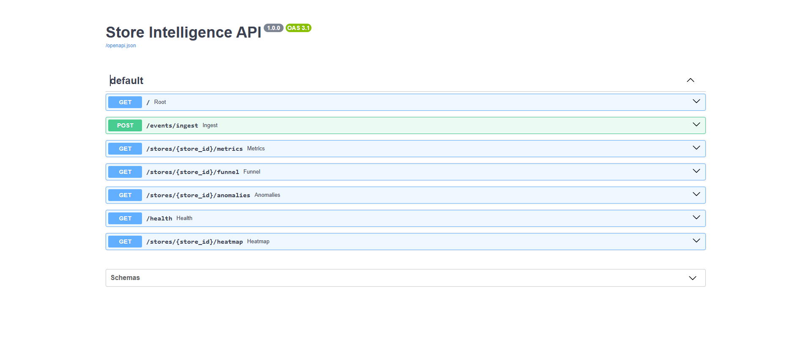
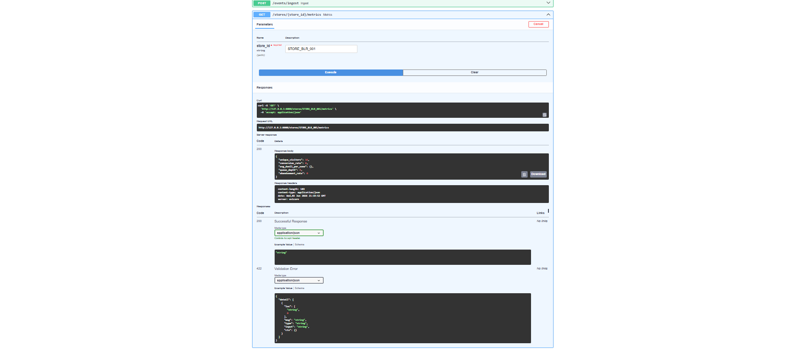
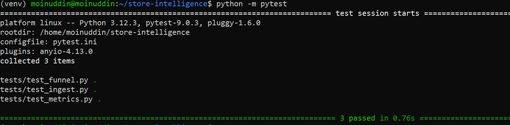

# Purplle Tech Challenge 2026 – Store Intelligence System

## Overview

This project implements an end-to-end AI-powered Store Intelligence System that converts raw CCTV footage into actionable retail analytics.

The solution combines:

* Computer Vision (YOLOv8)
* Multi-camera visitor tracking
* Event generation pipeline
* Real-time analytics APIs
* Anomaly detection
* Heatmap analytics
* Store funnel analysis
* Production-style REST APIs

The system processes CCTV footage from entry, floor, and billing cameras and generates structured events that can be consumed by downstream analytics systems.

---

# Architecture

```text
                CCTV Footage
                       │
                       ▼
               YOLOv8 Detection
                       │
                       ▼
              Visitor Tracking
                       │
                       ▼
             Event Generation
                       │
                       ▼
                JSONL Events
                       │
                       ▼
             Event Ingestion API
                       │
                       ▼
                 SQLite Store
                       │
          ┌────────────┼────────────┐
          ▼            ▼            ▼
      Metrics      Funnel       Heatmap
       API          API           API
          │            │            │
          └────────────┼────────────┘
                       ▼
               Swagger Dashboard
```

---

# Features

## Detection Pipeline

* YOLOv8 person detection
* Multi-person tracking
* Entry / Exit detection
* Visitor re-identification
* Staff filtering
* Billing queue monitoring
* Zone dwell tracking

---

## Event Types

Generated events include:

* ENTRY
* EXIT
* REENTRY
* ZONE_ENTER
* ZONE_EXIT
* ZONE_DWELL
* BILLING_QUEUE_JOIN
* BILLING_QUEUE_EXIT

Example Event:

```json
{
  "event_id": "a171b240-bd05-4c03-a5d7-5ab1246d83eb",
  "store_id": "STORE_BLR_001",
  "camera_id": "CAM_ENTRY_01",
  "visitor_id": "VIS_3693CF",
  "event_type": "ENTRY",
  "timestamp": "2026-06-03T20:27:26.977272+00:00",
  "confidence": 0.44
}
```

---

# Technology Stack

## AI / Computer Vision

* YOLOv8
* OpenCV
* NumPy

## Backend

* FastAPI
* SQLAlchemy
* SQLite

## Dashboard

* Streamlit

## Testing

* PyTest

---

# API Endpoints

## Event Ingestion

```http
POST /events/ingest
```

Ingest generated store events.

---

## Store Metrics

```http
GET /stores/{store_id}/metrics
```

Returns:

* Unique visitors
* Queue depth
* Dwell metrics
* Conversion metrics

---

## Funnel Analytics

```http
GET /stores/{store_id}/funnel
```

Returns:

* Entry count
* Zone visitors
* Billing visitors
* Purchase funnel

---

## Heatmap Analytics

```http
GET /stores/{store_id}/heatmap
```

Returns zone-level traffic statistics.

---

## Anomaly Detection

```http
GET /stores/{store_id}/anomalies
```

Detects:

* Queue spikes
* Dead zones
* Operational anomalies

---

## Health Monitoring

```http
GET /health
```

Returns service health status.

---

# Setup Instructions

## Clone Repository

```bash
git clone <repository-url>

cd purplle-store-intelligence-system
```

---

## Create Virtual Environment

```bash
python3 -m venv venv

source venv/bin/activate
```

---

## Install Dependencies

```bash
pip install -r requirements.txt
```

---

## Start API

```bash
uvicorn app.main:app --reload
```

Swagger UI:

```text
http://127.0.0.1:8000/docs
```

---

## Run Detection Pipeline

```bash
python pipeline/detect.py \
  --video "<video-path>" \
  --store-id STORE_BLR_001 \
  --camera-id CAM_ENTRY_01 \
  --camera-type ENTRY \
  --output events.jsonl
```

---

## Run Tests

```bash
python -m pytest
```

---

# Results

## CCTV Processing

Successfully processed CCTV footage from:

* Entry Cameras
* Floor Cameras
* Billing Cameras

---

## Generated Events

```text
39 Events Generated
```

---

## Analytics Results

Sample metrics output:

```json
{
  "unique_visitors": 16,
  "conversion_rate": 0,
  "avg_dwell_per_zone": {},
  "queue_depth": 0,
  "abandonment_rate": 0
}
```

---

## Test Results

```text
3 Passed
0 Failed
```

---

# AI-Assisted Engineering Decisions

AI tools were used to:

* Compare object detection models
* Design event schema
* Evaluate database choices
* Generate test scaffolding
* Review architecture trade-offs

All generated code and recommendations were manually reviewed, validated, and modified before integration.

---

# Future Improvements

* DeepSORT tracking
* Kafka event streaming
* PostgreSQL deployment
* Real-time dashboard updates
* SKU-level customer analytics
* Multi-store aggregation

---

## Screenshots

### Swagger API Documentation



### Metrics Endpoint



### Test Results


### Event Generation Output




# Author

Patan Meerja Moinuddin Khan

Purplle Tech Challenge 2026 Submission
